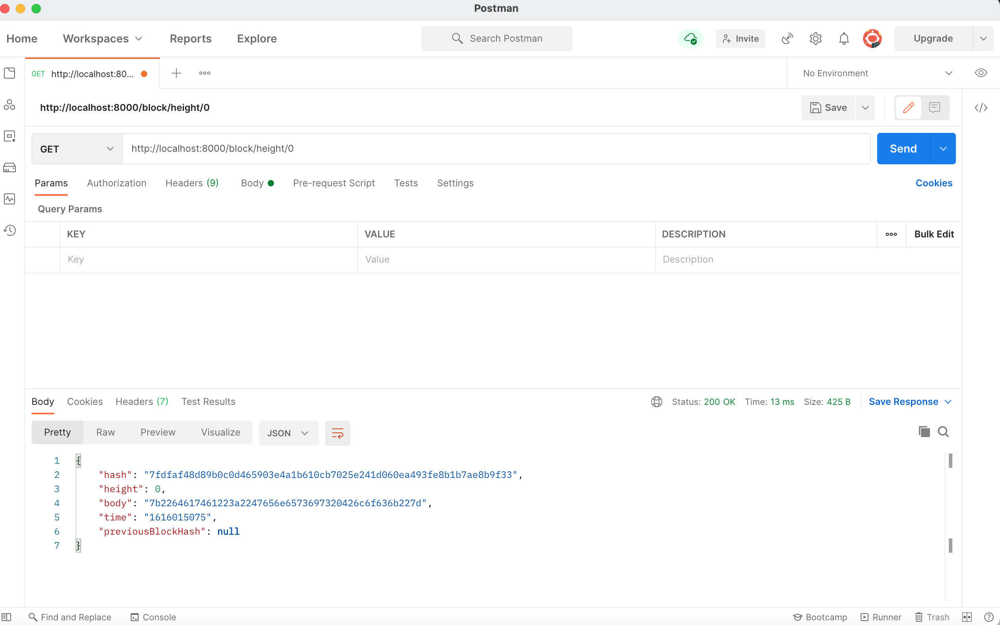
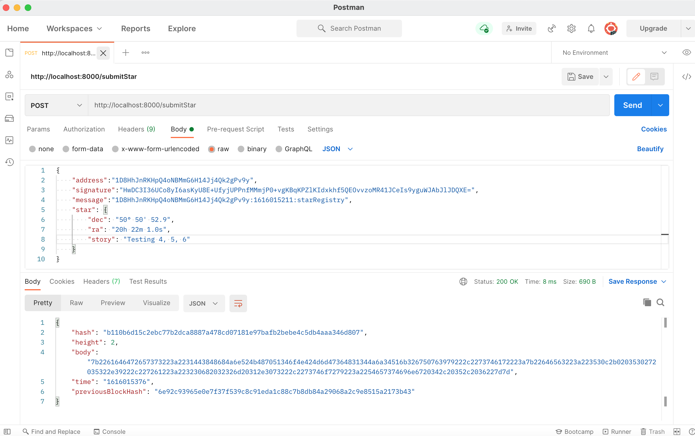
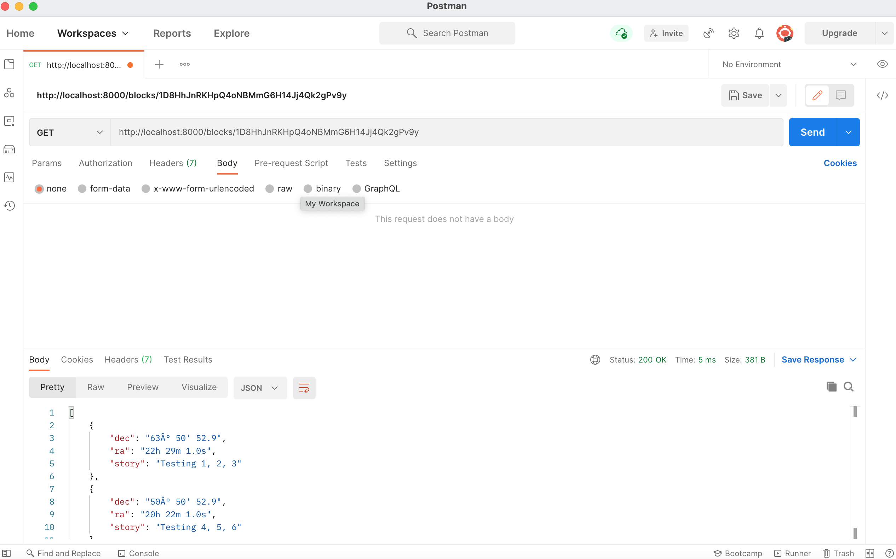

request the Genesis block:
    
Make your first request of ownership sending your wallet address:
    
Signed the message with Wallet and submit star twice:
     
     
Retrieve Stars owned by me
    
Get Block By Hash
    
Get Block By Height
    
Get Error Log Array Endpoint
    